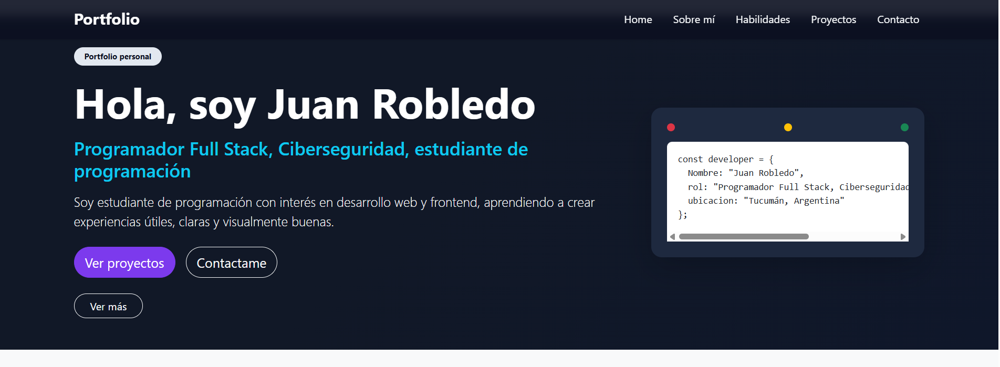
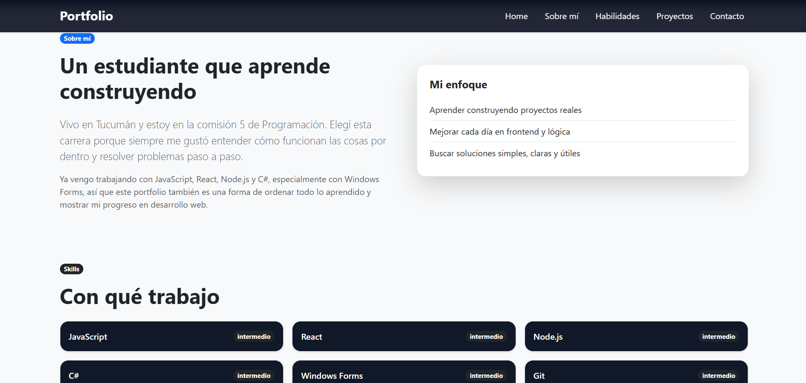
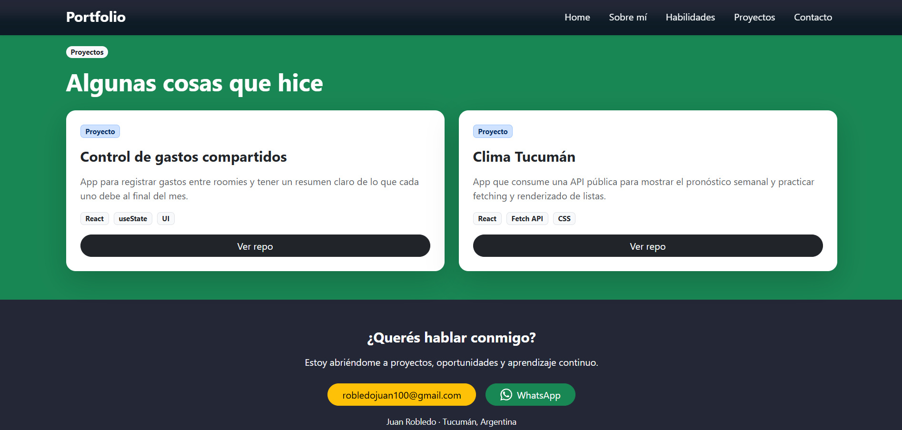

# Porfolio 

# Nombre y apellido del estudiante.
Robledo Juan Gerardo

# Descripción del proyecto

Este proyecto consiste en el desarrollo de un portfolio personal utilizando React y Bootstrap. La página presenta información sobre mí, mis habilidades y los conocimientos que fui adquiriendo durante la carrera.

El portfolio cuenta con una barra de navegación, una sección de bienvenida, información personal, habilidades, proyectos realizados y un pie de página con los datos de contacto. También incorpora un diseño adaptable para que la página pueda visualizarse correctamente en computadoras, tablets y celulares.

## Tecnologías Utilizadas
Frontend: React, JavaScript (ES6+), HTML5, CSS3
Estilos & UI: Bootstrap 5
Herramienta de Construcción: Vite
Control de Versiones: Git & GitHub

## Instrucciones de Instalación

1. Clonar el repositorio:
   ```bash
   git clone "https://github.com/Juanrobledo100/Practico-1-Programacion.git"

2. Entrar a la carpeta del proyecto con el comando: cd Porfolio

3. Instalar todas las dependencias del proyecto: npm install 

Nota: si no se instalan las librerias de bootstrap ejecutar el comando: npm install react-bootstrap bootstrap

## Ejecución en Entorno Local

1. acceder a la carpeta del Proyecto: cd Porfolio

2. ejectuar el comando: npm run dev

3. Abre tu navegador e ingresa a la URL que indica la terminal (por defecto es http://localhost:5173)

# Enlace al repositorio.
https://github.com/Juanrobledo100/Practico-1-Programacion

# Opcionalmente, capturas de pantalla o enlace a una versión publicada.
## Capturas de pantalla

### Página principal 



### Sección sobre mí y skills



### Sección de proyectos y footer 


